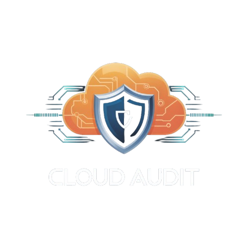

<p align="center">
  
</p>

<!-- mcp-name: io.github.gebalamariusz/cloud-audit -->
<h1 align="center">cloud-audit</h1>

<p align="center">
  <strong>Open-source AWS security scanner with Attack Chains, Breach Cost Estimation, and MCP Server for AI agents. The first CLI scanner that correlates findings into exploitable attack paths AND puts a dollar sign on each one. 47 checks. Every finding includes a fix.</strong>
</p>

<p align="center">
  <a href="https://pypi.org/project/cloud-audit/"></a>
  <a href="https://pypi.org/project/cloud-audit/"></a>
  <a href="https://github.com/gebalamariusz/cloud-audit/actions/workflows/ci.yml"></a>
  <a href="https://opensource.org/licenses/MIT"></a>
  <a href="https://pypi.org/project/cloud-audit/"></a>
  <a href="https://ghcr.io/gebalamariusz/cloud-audit"></a>
  <a href="https://www.helpnetsecurity.com/2026/03/11/cloud-audit-open-source-aws-security-scanner/"></a>
</p>

---

<p align="center">
  <a href="https://www.youtube.com/watch?v=5uHoqggmTB8">
    
  </a>
  <br>
  <sub>Click to watch the demo video</sub>
</p>

cloud-audit scans your AWS account and tells you exactly how to fix what it finds - AWS CLI commands, Terraform HCL, and documentation links you can copy-paste.

47 checks across 15 AWS resource types. Mapped to 16 CIS AWS Foundations Benchmark controls. 16 attack chain rules that correlate findings into exploitable attack paths.

**Five things no other open-source CLI scanner does:**

### 1. MCP Server - ask your AI to scan AWS

> **The first free, standalone AWS security MCP server.** Prowler and Wiz have MCP servers, but both require their paid SaaS platform ($99+/month). cloud-audit MCP works locally - zero accounts, zero API keys, zero data sent anywhere.

**One command to install:**

```bash
claude mcp add cloud-audit -- uvx --from cloud-audit cloud-audit-mcp
```

**Then just ask:**

> *"Scan my AWS account and show me the critical findings"*
>
> *"What attack chains were detected?"*
>
> *"How much risk exposure does my account have in dollars?"*
>
> *"Show me the Terraform code to fix aws-iam-001"*

6 tools: `scan_aws`, `get_findings`, `get_attack_chains`, `get_remediation`, `get_health_score`, `list_checks`. Works with Claude Code, Cursor, and VS Code Copilot.

<details>
<summary>Alternative install methods</summary>

```bash
# With pip
pip install cloud-audit
claude mcp add cloud-audit -- cloud-audit-mcp
```

```json
// Project-scoped config (.mcp.json in repo root - shared with team)
{
  "cloud-audit": {
    "command": "uvx",
    "args": ["cloud-audit-mcp"]
  }
}
```

</details>

### 2. Attack Chains - correlate findings into real attack paths

Other scanners give you a flat list of 200+ findings. cloud-audit **correlates them into attack paths** an attacker would actually exploit.

<p align="center">
  <a href="#"></a>
  <a href="https://attack.mitre.org/matrices/enterprise/cloud/"></a>
  <a href="https://github.com/DataDog/pathfinding.cloud"></a>
</p>

**How it works:** individual findings are correlated into real attack paths:

```
                    +-----------+      +----------+      +-----------+
  Internet -------->| Public SG |----->| EC2 Inst |----->| IMDS (v1) |
                    +-----------+      +----------+      +-----------+
                     aws-vpc-002        aws-ec2-004            |
                                                               v
                                                      +-----------------+
                                                      | Admin IAM Creds |
                                                      +-----------------+
                                                               |
                                                               v
                                                    +---------------------+
                                                    | Full Account Takeover|
                                                    +---------------------+
                               Detected by: AC-01, AC-02
```

```
cloud-audit scan --format html --output report.html

+---- Attack Chains (3 detected) -----------------------------------+
|                                                                    |
|  CRITICAL  Internet-Exposed Admin Instance                         |
|            i-0abc123 - public SG + admin IAM role                  |
|            > Attacker reaches EC2 > steals IMDS creds > admin      |
|            Fix: Restrict security group (effort: LOW)              |
|                                                                    |
|  CRITICAL  CI/CD to Admin Takeover                                 |
|            github-deploy - OIDC no sub + admin policy              |
|            > Any GitHub repo can assume admin AWS role              |
|            Fix: Add sub condition (effort: LOW)                    |
|                                                                    |
|  HIGH      Zero Security Visibility                                |
|            No CloudTrail + No GuardDuty + No Config                |
|            > Attackers operate completely undetected                |
|            Fix: Enable CloudTrail (effort: LOW)                    |
|                                                                    |
+--------------------------------------------------------------------+

Found 3 attack chains from 22 individual findings.
```

#### What others don't have

| Feature | Prowler | Trivy | Checkov | cloud-audit |
|---------|---------|-------|---------|-------------|
| Individual checks | 584 | 517 | 2500+ | **47** |
| Attack chain detection | No | No | No | **16 rules** |
| Remediation per finding | Partial | No | Links | **100%** |
| Breach cost estimation | No | No | No | **Per finding + chain** |
| MCP server (AI agents) | Paid ($99/mo) | No | No | **Free, standalone** |
| Scan time (typical) | 4+ hours | Minutes | Seconds (IaC) | **Seconds** |

<details>
<summary><strong>All 16 attack chain rules</strong> (click to expand)</summary>

| ID | Name | Severity | Component Checks |
|---|---|---|---|
| AC-01 | Internet-Exposed Admin Instance | CRITICAL | aws-vpc-002 + EC2 IAM role |
| AC-02 | SSRF to Credential Theft | CRITICAL | aws-vpc-002 + aws-ec2-004 |
| AC-05 | Public Lambda with Admin Access | CRITICAL | aws-lambda-001 + Lambda IAM role |
| AC-07 | CI/CD to Admin Takeover | CRITICAL | aws-iam-007 + IAM role policies |
| AC-09 | Unmonitored Admin Access | CRITICAL | aws-iam-001 + aws-ct-001 |
| AC-10 | Completely Blind Admin | CRITICAL | aws-iam-001 + aws-ct-001 + aws-gd-001 |
| AC-11 | Zero Security Visibility | HIGH | aws-ct-001 + aws-gd-001 + aws-cfg-001 |
| AC-12 | Admin Without MFA | CRITICAL | aws-iam-005 + aws-iam-002 |
| AC-13 | Wide Open and Unmonitored Network | HIGH | aws-vpc-002 + aws-vpc-003 |
| AC-14 | No Network Security Layers | HIGH | aws-vpc-004 + aws-vpc-002 + aws-vpc-003 |
| AC-17 | Exposed Database Without Audit Trail | CRITICAL | aws-rds-001 + aws-rds-002 + aws-ct-001 |
| AC-19 | Container Breakout Path | CRITICAL | aws-ecs-001 + aws-ecs-003 |
| AC-20 | Unmonitored Container Access | HIGH | aws-ecs-002 + aws-ecs-003 |
| AC-21 | Secrets in Plaintext Across Services | HIGH | aws-ssm-002 + aws-lambda-003 |
| AC-23 | CI/CD Data Exfiltration | HIGH | aws-iam-007 + IAM role S3 policies |
| AC-24 | CI/CD Lateral Movement | HIGH | aws-iam-007 + IAM role EC2 policies |

Based on [MITRE ATT&CK Cloud](https://attack.mitre.org/matrices/enterprise/cloud/), [Datadog pathfinding.cloud](https://github.com/DataDog/pathfinding.cloud), and AWS CIRT research.

</details>

### 3. Every finding includes a copy-paste fix

You don't just get a list of problems - you get the exact commands to fix them:

```
$ cloud-audit scan -R

  CRITICAL  Root account without MFA enabled
  Resource:   arn:aws:iam::123456789012:root
  Compliance: CIS 1.5
  CLI:        aws iam create-virtual-mfa-device --virtual-mfa-device-name root-mfa
  Terraform:  resource "aws_iam_virtual_mfa_device" "root" { ... }
  Docs:       https://docs.aws.amazon.com/IAM/latest/UserGuide/...
```

### 4. Built-in scan diff - track what changed

Run daily scans and compare them. See what got fixed, what's new, and what stayed the same - without a SaaS dashboard or paid backend.

```
$ cloud-audit diff yesterday.json today.json

╭───────── Score Change ──────────╮
│ 54 -> 68 (+14)                  │
╰─────────────────────────────────╯

Fixed (2):
  CRITICAL  aws-iam-001     root               Root account without MFA
  HIGH      aws-vpc-002     sg-abc123          SG open on port 22

New (1):
  HIGH      aws-rds-001     staging-db         RDS publicly accessible

Unchanged (8):
  ...
```

This catches what IaC scanning misses: ClickOps changes, manual console edits, security group rules someone opened "temporarily" three months ago. Prowler offers similar tracking, but only through their paid cloud platform. Trivy, ScoutSuite, and Steampipe don't have it at all.

Exit code 0 = no new findings, 1 = regression. Plug it into a cron job, get notified when something gets worse. See [daily-scan-with-diff.yml](examples/daily-scan-with-diff.yml) for a ready-to-use GitHub Actions workflow.

### 5. Breach cost estimation - dollar signs on every finding

Security teams speak in severities. Boards speak in dollars. cloud-audit translates findings into estimated financial risk based on published breach data (IBM Cost of a Data Breach 2024, Verizon DBIR, HIPAA enforcement actions).

```
+---- Health Score ----+
|  42 / 100            |   Risk exposure   $725K - $7.3M
+----------------------+

+---- Attack Chains (2 detected) ------------------------------------------+
|                                                                           |
|  CRITICAL  SSRF to Credential Theft                                       |
|            i-0abc123 - public SG + IMDSv1                                 |
|            Fix: Enforce IMDSv2 (effort: LOW)                              |
|            Risk: $125K - $1.3M                                            |
|                                                                           |
+--------------------------------------------------------------------------+
```

No other open-source scanner puts dollar amounts on findings. Every estimate links to its source (IBM, Verizon, OCC, MITRE) so you can verify it yourself.

## Quick Start

```bash
pip install cloud-audit
cloud-audit scan
```

That's it. Uses your default AWS credentials and region. You'll get a health score and a list of findings in your terminal.

```bash
# Show remediation details for each finding
cloud-audit scan -R

# Specific profile and regions
cloud-audit scan --profile production --regions eu-central-1,eu-west-1

# Export all fixes as a runnable bash script
cloud-audit scan --export-fixes fixes.sh
```

## Try it without an AWS account

```bash
pip install cloud-audit
cloud-audit demo
```

The `demo` command runs a simulated scan with sample data - output format, health score, and remediation details without any AWS credentials.

## Who is this for

- **Small teams without a security team** - get visibility into AWS security without buying a platform. Attack chains show you which findings actually matter
- **DevOps/SRE running pre-deploy checks** - catch misconfigurations before they ship, with compound risk detection
- **Consultants auditing client accounts** - generate a professional HTML report with attack chains and executive summary in one command
- **Teams that want CIS evidence without Security Hub** - 16 CIS controls mapped, included in reports

## What it checks

47 checks across IAM, S3, EC2, EIP, VPC, RDS, Lambda, ECS, CloudTrail, GuardDuty, KMS, SSM, Secrets Manager, CloudWatch, and AWS Config. Plus 16 attack chain rules that correlate findings into exploitable attack paths.

**By severity:** 9 Critical, 14 High, 16 Medium, 8 Low.

Every check answers one question: *would an attacker exploit this?* If not, the check doesn't exist.

<details>
<summary>Full check list</summary>

### Security

| ID | Severity | Description |
|----|----------|-------------|
| `aws-iam-001` | Critical | Root account without MFA |
| `aws-iam-002` | High | IAM user with console access but no MFA |
| `aws-iam-003` | Medium | Access key older than 90 days |
| `aws-iam-004` | Medium | Access key unused for 30+ days |
| `aws-iam-005` | Critical | IAM policy with Action: \* and Resource: \* |
| `aws-iam-006` | Medium | Password policy below CIS requirements |
| `aws-iam-007` | Critical | OIDC trust policy without sub condition |
| `aws-s3-001` | High | S3 bucket without public access block |
| `aws-s3-002` | Low | S3 bucket using SSE-S3 instead of SSE-KMS |
| `aws-s3-005` | Medium | S3 bucket without access logging |
| `aws-ec2-001` | High | Publicly shared AMI |
| `aws-ec2-002` | Medium | Unencrypted EBS volume |
| `aws-ec2-004` | High | EC2 instance with IMDSv1 (SSRF risk) |
| `aws-vpc-001` | Medium | Default VPC in use |
| `aws-vpc-002` | Critical | Security group open to 0.0.0.0/0 on sensitive ports |
| `aws-vpc-003` | Medium | VPC without flow logs |
| `aws-vpc-004` | Medium | Network ACL allows all inbound from 0.0.0.0/0 |
| `aws-rds-001` | Critical | Publicly accessible RDS instance |
| `aws-rds-002` | High | Unencrypted RDS instance |
| `aws-ct-001` | Critical | No multi-region CloudTrail trail |
| `aws-ct-002` | High | CloudTrail log file validation disabled |
| `aws-ct-003` | Critical | CloudTrail S3 bucket is publicly accessible |
| `aws-gd-001` | High | GuardDuty not enabled |
| `aws-gd-002` | Medium | GuardDuty findings unresolved for 30+ days |
| `aws-cfg-001` | Medium | AWS Config not enabled |
| `aws-cfg-002` | High | AWS Config recorder stopped |
| `aws-kms-001` | Medium | KMS key without automatic rotation |
| `aws-kms-002` | High | KMS key policy with Principal: \* |
| `aws-cw-001` | High | No CloudWatch alarm for root account usage |
| `aws-lambda-001` | High | Lambda function URL with no authentication |
| `aws-lambda-002` | Medium | Lambda running on a deprecated runtime |
| `aws-lambda-003` | High | Potential secrets in Lambda environment variables |
| `aws-ecs-001` | Critical | ECS task running in privileged mode |
| `aws-ecs-002` | High | ECS task without log configuration |
| `aws-ecs-003` | Medium | ECS service with Execute Command enabled |
| `aws-ssm-001` | Medium | EC2 instance not managed by Systems Manager |
| `aws-ssm-002` | High | SSM parameter with secret stored as plain String |
| `aws-sm-001` | Medium | Secrets Manager secret without rotation |

### Cost

| ID | Severity | Description |
|----|----------|-------------|
| `aws-eip-001` | Low | Unattached Elastic IP ($3.65/month) |
| `aws-ec2-003` | Low | Stopped EC2 instance (EBS charges continue) |
| `aws-s3-004` | Low | S3 bucket without lifecycle rules |
| `aws-sm-002` | Low | Secrets Manager secret unused for 90+ days ($0.40/month) |

### Reliability

| ID | Severity | Description |
|----|----------|-------------|
| `aws-s3-003` | Low | S3 bucket without versioning |
| `aws-rds-003` | Medium | Single-AZ RDS instance (no automatic failover) |
| `aws-rds-004` | Low | RDS auto minor version upgrade disabled |
| `aws-ec2-005` | Low | EC2 instance without termination protection |
| `aws-ec2-006` | Medium | EBS default encryption disabled |

</details>

## Export fixes as a script

```bash
cloud-audit scan --export-fixes fixes.sh
```

The script is commented and uses `set -e` - review it, uncomment what you want to apply, and run.

## Reports

<p align="center">
  
</p>

```bash
# HTML report (dark-mode, self-contained, client-ready)
cloud-audit scan --format html --output report.html

# JSON
cloud-audit scan --format json --output report.json

# SARIF (GitHub Code Scanning integration)
cloud-audit scan --format sarif --output results.sarif

# Markdown (for PR comments)
cloud-audit scan --format markdown --output report.md
```

Format is auto-detected from file extension when using `--output`.

## Installation

### pip (recommended)

```bash
pip install cloud-audit
```

### pipx (isolated environment)

```bash
pipx install cloud-audit
```

### Docker

```bash
docker run ghcr.io/gebalamariusz/cloud-audit scan
```

Mount your AWS credentials:

```bash
docker run -v ~/.aws:/home/cloudaudit/.aws:ro ghcr.io/gebalamariusz/cloud-audit scan
```

### From source

```bash
git clone https://github.com/gebalamariusz/cloud-audit.git
cd cloud-audit
pip install -e .
```

## Usage

```bash
# Scan all enabled regions
cloud-audit scan --regions all

# Filter by category
cloud-audit scan --categories security,cost

# Filter by minimum severity
cloud-audit scan --min-severity high

# Cross-account scanning via IAM role
cloud-audit scan --role-arn arn:aws:iam::987654321098:role/auditor

# Quiet mode (exit code only - for CI/CD)
cloud-audit scan --quiet

# List all available checks
cloud-audit list-checks
cloud-audit list-checks --categories security
```

### Exit codes

| Code | Meaning |
|------|---------|
| 0 | No findings (after suppressions and severity filter) |
| 1 | Findings detected |
| 2 | Scan error (bad credentials, invalid config) |

<details>
<summary>Configuration file</summary>

Create `.cloud-audit.yml` in your project root:

```yaml
provider: aws
regions:
  - eu-central-1
  - eu-west-1
min_severity: medium
exclude_checks:
  - aws-eip-001
  - aws-ec2-003
suppressions:
  - check_id: aws-vpc-001
    resource_id: vpc-abc123
    reason: "Legacy VPC, migration planned for Q3"
    accepted_by: "jane@example.com"
    expires: "2026-09-30"
```

Auto-detected from the current directory. Override with `--config path/to/.cloud-audit.yml`.

</details>

<details>
<summary>Environment variables</summary>

| Variable | Description | Example |
|----------|-------------|---------|
| `CLOUD_AUDIT_REGIONS` | Comma-separated regions | `eu-central-1,eu-west-1` |
| `CLOUD_AUDIT_MIN_SEVERITY` | Minimum severity filter | `high` |
| `CLOUD_AUDIT_EXCLUDE_CHECKS` | Comma-separated check IDs to skip | `aws-eip-001,aws-iam-001` |
| `CLOUD_AUDIT_ROLE_ARN` | IAM role ARN for cross-account | `arn:aws:iam::...:role/auditor` |

</details>

**Precedence:** CLI flags > environment variables > config file > defaults.

## CI/CD Integration

### GitHub Actions

```yaml
- run: pip install cloud-audit
- run: cloud-audit scan --format sarif --output results.sarif
- uses: github/codeql-action/upload-sarif@v3
  with:
    sarif_file: results.sarif
```

This gives you findings in the GitHub Security tab (via SARIF). Add `--format markdown` for PR comments.

### Ready-to-use workflows

| Workflow | Use case |
|----------|----------|
| [github-actions.yml](examples/github-actions.yml) | Basic scan with SARIF upload and PR comments |
| [daily-scan-with-diff.yml](examples/daily-scan-with-diff.yml) | Scheduled daily scan + diff to catch drift |
| [post-deploy-scan.yml](examples/post-deploy-scan.yml) | Scan before and after `terraform apply` |

**Daily diff** is the most common setup - it catches ClickOps changes, manual console edits, and regressions that IaC scanning can't see (because IaC scans code, not live AWS).

## AWS Permissions

cloud-audit requires **read-only** access. Attach the AWS-managed `SecurityAudit` policy:

```bash
aws iam attach-role-policy \
  --role-name auditor-role \
  --policy-arn arn:aws:iam::aws:policy/SecurityAudit
```

cloud-audit never modifies your infrastructure. It only makes read API calls.

## Health Score

Starts at 100, decreases per finding:

| Severity | Points deducted |
|----------|----------------|
| Critical | -20 |
| High | -10 |
| Medium | -5 |
| Low | -2 |

80+ is good, 50-79 needs attention, below 50 requires immediate action.

## Alternatives

There are mature tools in this space. Pick the right one for your use case:

- **[Prowler](https://github.com/prowler-cloud/prowler)** - 576+ checks across AWS/Azure/GCP, full CIS benchmark coverage, auto-remediation with `--fix`. The most comprehensive open-source scanner. Best for teams that need exhaustive compliance audits and don't mind longer scan times.
- **[ScoutSuite](https://github.com/nccgroup/ScoutSuite)** - Multi-cloud scanner with an interactive HTML report. No releases in over 12 months - effectively unmaintained.
- **[Trivy](https://github.com/aquasecurity/trivy)** - Container, IaC, and cloud scanner. Strong on containers, growing cloud coverage (~517 cloud checks).
- **[Steampipe](https://github.com/turbot/steampipe)** - SQL-based cloud querying. Very flexible, but requires writing or configuring queries.
- **[AWS Security Hub](https://aws.amazon.com/security-hub/)** - Native AWS service with continuous monitoring and ~223 checks. Free 30-day trial, then charges per check evaluation.

cloud-audit fills a specific niche: a focused audit with copy-paste remediation for each finding, plus **attack chain detection** that correlates individual findings into exploitable paths - the only open-source CLI scanner with compound risk detection. If you need full CIS compliance coverage, Prowler is the better choice. If you need a quick scan that shows how findings combine into real attack paths and tells you exactly how to fix each issue, cloud-audit is built for that.

## What's next

- Terraform drift detection - compare scan results against tfstate
- Root cause grouping - "fix 1 setting, close 12 findings"
- More attack chain rules based on community feedback

Past releases: [CHANGELOG.md](CHANGELOG.md)

## Development

```bash
git clone https://github.com/gebalamariusz/cloud-audit.git
cd cloud-audit
pip install -e ".[dev]"

pytest -v                          # tests
ruff check src/ tests/             # lint
ruff format --check src/ tests/    # format
mypy src/                          # type check
```

See [CONTRIBUTING.md](CONTRIBUTING.md) for how to add a new check.

## License

[MIT](LICENSE) - Mariusz Gebala / [HAIT](https://haitmg.pl)
